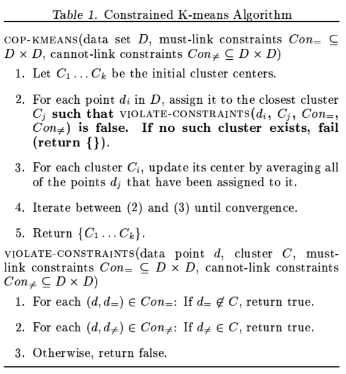
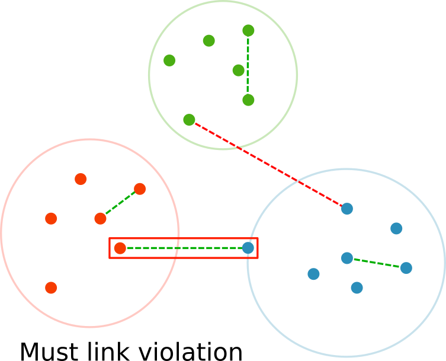
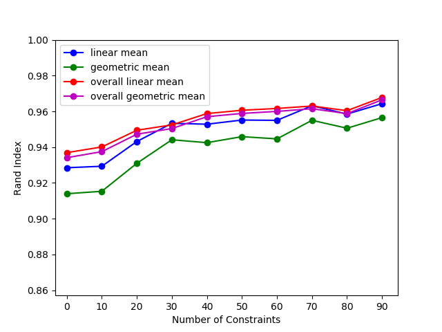
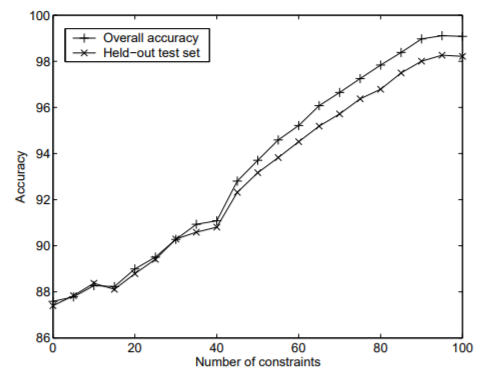
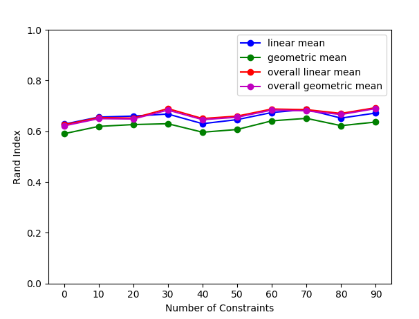
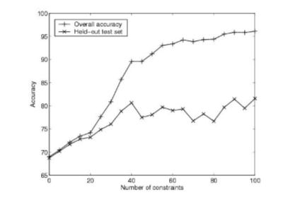
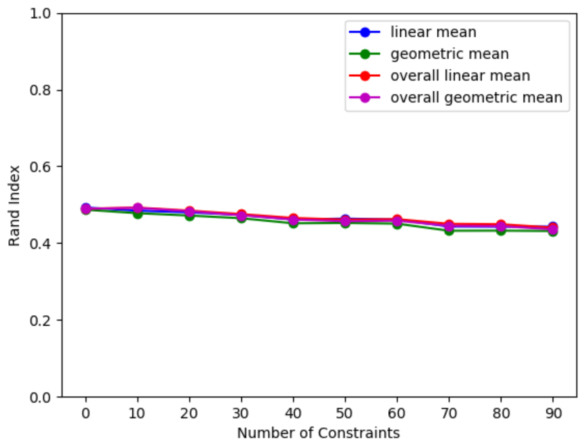
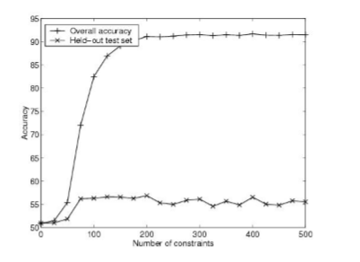

# Constrained K-Means Clustering with Background Knowledge

## Background

Wagstaff, Cardie, Rogers, and Schroedl published a paper in the Eighteenth International Conference on Machine Learning, 2001, in which they proposed an adaptation to the standard k-means clustering algorithm.  This was written after a previous paper by Wagstaff and Cardie where they take a version of the COBWEB clustering algorithm and apply instance-level constraints in a similar manner. This was used for most of their baselines in their Constrained K-means alrogithm. The k-means algorithm was first named by MacQueen in 1967 where he introduced several proofs and lemmas relating to the algorithm. The algorithm has become one of the more common and simple clustering algorithms.

This algorithm uses background information about pairs of data points that must be in the same cluster, or in different clusters. The addition of this information allows a greater clustering accuracy. Instead of just putting a point in the nearest cluster, it puts it in the nearest valid cluster. If there is a must-link pair that a point is a member of, it will be placed in the same cluster as the other member of the must-link pair. If a point is a member of a can't-link pair, it will not be placed in the same cluster as the other member of the can't-link pair, even if it is the closest cluster. 

In the paper, constrained k-means is applied to five different UCI datasets: soybean, mushroom, tic-tac-toe, iris, and wine. The graphs generated show the overall accuracy as well as the accuracy on a hold-out portion of the dataset as a function of the number of constraints used in the clustering. The constraints are generated by randomly picking data points from the dataset and checking their labels to determine if they should be in the same cluster or not. They ran 100 trials where each trial was a 10-fold cross validation test and averaged to generate the test.

## Methodology

When gathering results we use both the linear (1) and geometric (2) means of our accuracy measure.

The original paper uses the linear mean, so we have included it for direct comparison; however, a geometric mean will havily penalize the final score when there is even one particularly poor result. This means that to achieve a high final rating, every test must return a good result.

Similar to the original work, we implement a 10-fold crossvalidation scheme for training and validation purposes. The clusters are trained on 9 of the folds and the 10th is held out as a validation set. The overall score measures the performance of all 10 folds together. 

In the original work, the authors also perform several "trials" for each set of constraints. We do the same here, so the data in our results represents not only the mean scores for a crossvalidation set, but also the mean of a set of "trials".

## Results
### Soybean:
#### Our results

#### Original Soybean results

The soybean dataset is small with only 47 samples and 35 attributes with 4 class values. The trendline in our results agree with the trend in the original paper. However, through our testing we did not see the same amount of improvment from basic K-Means (0-constraints).

### Mushroom:
#### Our results

#### Original Mushroom results

The mushroom dataset is considerably larger than the soybean set with 8k+ samples and 22 features. One of the features is ill conditioned (due to several datapoints missing information) so the original authors removed that feature from their analysis and we followed suit. Additionally, to decrease the computation time, the authors use only 50 samples/trial, and the same was done here. The results do not correlate nearly as well as the soybean dataset. However, the held-out is still in a similar range and exhibits a similar behavior as the original.

### Tic Tac Toe:
#### Our results

#### Original Tic Tac Toe results

The Tic Tac Toe dataset is also larger than soybean with nearly 1k samples. The dataset measures the possible set of board configurations for a game where X makes the first move. To simplify analysis we again follow the lead of the original authors and use only 100 samples/trial. Similar to the mushroom dataset, the held-out behavior is similar to that of the original, but the overall accuracy does not increase like it does in the original.

## Discussion

Our results do not align well in general with those from the original paper. Several differences between our approach and theirs could explain some of the discrepancies:
1. Sample selection:   
The original paper does not specify exactly how their limited dataset was sampled. We saw clearer trend agreement in the soybean dataset, which does not downsample from the data. 

2. Cross validation procedure:   
There could be some minor difference in implementation; however, we believe our cross validation procedure is correct and most likely not the cause of these discrepancies.

3. Overall data selection:   
Which data was used for the overall test score could change the result. We believe we have this procedure correct in that we used all folds from a 10-fold cross validation as the "overall" dataset.

4. Definition of distance metric:   
The distance metric used to identify the nearest cluster for a given point could have been very different in implementation. In particular: since all of these datasets are symbolically categorized in each feature the definition of distance can become ambiguous.

5. Dataset processing:   
On a similar note, how the data is processed could affect the way distance and clusters are calculated. Whether or not their data was processed symbolically or numerically could affect how the rest of the program proceeds. 

6. Constraint Generation:   
The generation of constraints could have a major effect on the algorithm's performance; however, we believe our random generation is inline with the original author's methods. 

One point of interest is that our performance seems to align approximately on level with the hold-out sets from the original paper. This could be due to a different definition for the "held-out" set, or some other unknown cause. 